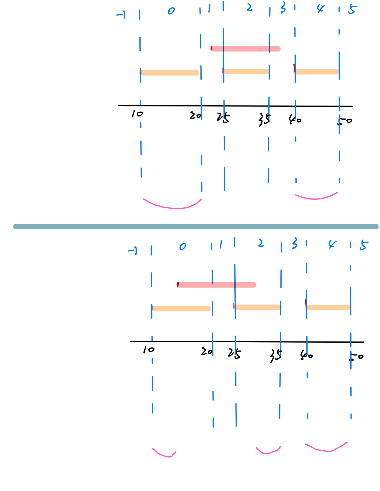

# range-list

for jerry.ai


## Usage

```js
const rl = new RangeList();

rl.add([1, 5]); rl.print(); // Should display: [1, 5)

rl.add([10, 20]); rl.print(); // Should display: [1, 5) [10, 20)

rl.remove([10, 11]); rl.print(); // Should display: [1, 8) [11, 21)

rl.remove([15, 17]); rl.print(); // Should display: [1, 8) [11, 15) [17, 21)

```

## graphic

### Add


### remove

